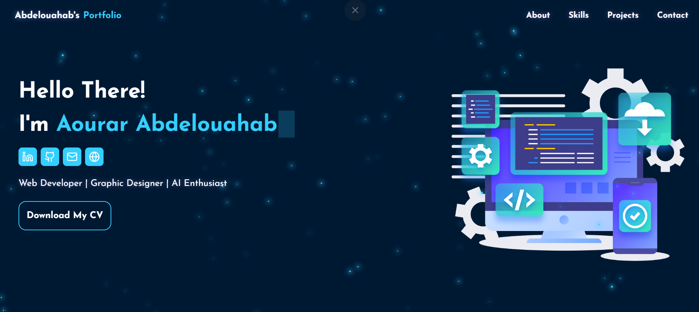

# 🌟 Personal Portfolio
A modern, responsive personal portfolio built with **React** to showcase my projects, skills, and experience.

---

## 🌐 Live Demo  
👉 [View Portfolio](https://abdelouahab-portfolio.vercel.app/)

---

## 📌 Features
- ⚡ Built with **React** for fast performance  
- 📱 Fully responsive design (mobile, tablet, desktop)  
- 🧑‍💻 About Me & Skills section  
- 🗂️ Projects with live links & GitHub repos  
- 📬 Contact form & social media integration  

---

## 🛠️ Tech Stack
- **Frontend:** React, JavaScript (ES6+)  
- **Styling:** Tailwind CSS   
- **Deployment:** Vercel 

---

## ⚙️ Installation & Setup

1. **Clone the repository**
    git clone https://github.com/Abdelouahab-aourar/abdelouahab-portfolio.git
2. **Navigate to the project folder**
    cd abdelouahab-portfolio
3. **Install dependencies**
    npm install
4. **Start the server**
    npm run dev

---

## 📸 Screenshots

---
## 🤝 Contributing

Contributions, issues, and feature requests are welcome!
Feel free to fork this repo and submit a pull request.

---

## 📫 Contact

- **Portfolio:** [abdelouahab-portfolio.vercel.app/](https://abdelouahab-portfolio.vercel.app/)  
- **LinkedIn:** [Aourar Abdelouahab](https://www.linkedin.com/in/aourar-abdelouahab/)  
- **Email:** [abdelouahab.aourar@gmail.com](mailto:abdelouahab.aourar@gmail.com)
